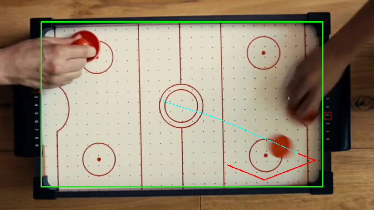

# AirHokey-Robot
This project is a robot that plays air hockey.

Mainly based on:
- Ubuntu 20.04.2 LTS
- python 3.8.5
- YoLoV5 


## Install
create and activate a virtual environment

```
$ virtualenv --python /usr/bin/python3.8 airhockey-env
$ source airhockey-env/bin/activate
```

cd to the project directory
```
$ pip install -r requirements.txt
```
**↑ if this doesn't work, try installing the packages manually**  
_Main packages:_   
- numpy-1.24.4  
- matplotlib  
- opencv-python  


## Vision
### quick start
```
$ python test_vision.py
```

